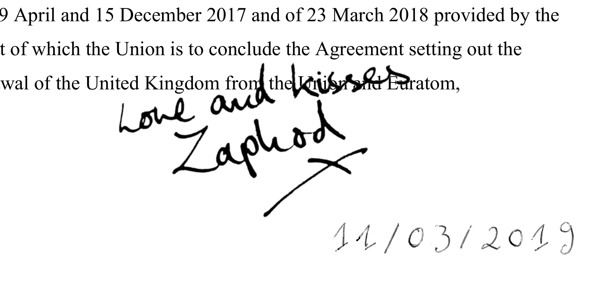

## Description

Simple python module to add handwritten signatures to pdf files in selected locations. In addition, date strings from handwritten numerals are automatically assembled and can equally be placed freely in the existing pdf.

This is dockerized due to non-trivial dependencies (ImageMagick) and the ambition to get this to run on exotic operatic systems (Windows).

`docker run -it -w /home/user -e DISPLAY=$DISPLAY -v /tmp/.X11-unix:/tmp/.X11-unix -v /home/user/watermark/src:/home/user/src -v /home/user/watermark/signatures:/home/user/signatures -v /home/user/watermark/tgt:/home/user/tgt -v /home/user/watermark/:/home/user/ watermark_this_signpdf:latest python3 src/add_signature.py tgt/tgt.pdf 0.2`

## Kudos
__________
The `fancy_watermark.py` example of the marvellous [pdfrw](https://github.com/pmaupin/pdfrw) library served as a starting point for signpdf.

## Get high-quality signature pdfs
____________________________________

* Scan in whatever format
* Use gimp to convert to generate a transparency layer mask using the "Grayscale copy of layer" mode
* In gimp, invert the mask (Colors>Invert)
* Save as png file
* Use ImageMagick for transparency-conserving conversion to pdf: `convert -channel rgba -alpha on signature.png signature.pdf`
