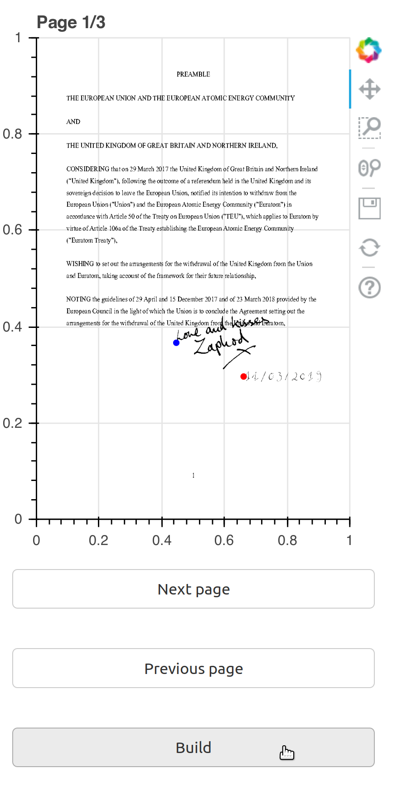

# signpdf

A simple python module to add handwritten signatures to pdf files in selected locations. In addition, date strings from handwritten numerals are automatically assembled and can equally be placed freely in the existing pdf.

___________________________________

______________________________________

This is dockerized due to non-Python dependencies (ImageMagick) and the ambition to make it platform independent. However, the resulting docker image is somewhat bulky.

## Instructions
### Setup

* Clone or download
* Replace the pdf files in the [signature](signature) and [numbers](numbers) folders (unless you are an obnoxious space-dictator; then feel free to just stick with the default signature). **Note:** To avoid repetition of the handwritten numerals in the date string, multiple files can be provided for each number (for example [3_1.pdf](numbers/3_1.pdf), [3_2.pdf](numbers/3_2.pdf), and [3_3.pdf](numbers/3_3.pdf) for the numeral 3). The exact number of files per numeral is flexible and only affects the esthetics of the result. The files [s_1.pdf](numbers/s_1.pdf) etc are the date string separators. They are slashes in the example case but could be any other symbol (still with filenames "s_*").

### Usage
* Copy the target pdf file to the root directory, replacing the *example_document.pdf*. For predictable behavior, only one pdf file should be in the root directory at any time, unless its filename ends with *_signed.pdf* (in which case it is the output document). Needless to say that input documents must not have filenames *\*_signed.pdf* 
* Fire up docker-compose.
* Open [http://localhost:5006/app](http://localhost:5006/app) in a browser.
* A page preview of the input pdf is shown (see below). Clicking on the preview will add red and blue markers for the signature and the date, respectively. Clicking on the build button will insert the signature pdf and the assembled date string at the respective locations by building a new pdf file (*example_document_signed.pdf* in the root directory).

* Move between pages using the corresponding buttons.
* Adding only dates without signature can be achieved by placing the signature outside the page.
* The output file is replaced each time the **Build** button is pushed.
* To start over, refresh the browser page.

## Get high-quality signature pdfs

The final result quality is only as good as the input pdf files for the signature and the numerals. Here is how the make them:

* Scan required text in whatever format
* Use [GIMP](https://www.gimp.org/) (or any other image manipulation software) to generate a transparency layer mask using the "Grayscale copy of layer" mode (right-click on layer&rarr;"Add layer mask").
* Invert the mask (Colors&rarr;Invert)
* Save as pdf file
* In the resulting pdf file all white space should be transparent.

## Kudos

The `fancy_watermark.py` example of the marvellous [pdfrw](https://github.com/pmaupin/pdfrw) library served as a starting point for signpdf.

